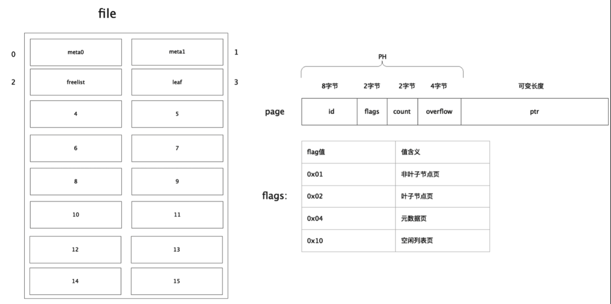
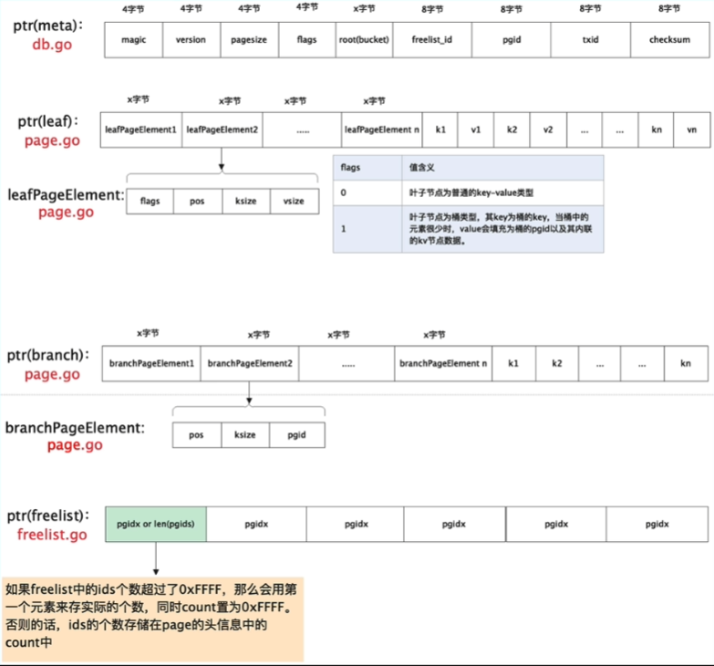

# distributekv

google 一下 boltdb

https://zhuanlan.zhihu.com/p/676356164

## 首先介绍一下boltdb是怎么实现的

#### boltdb 存储引擎磁盘结构

首先 bolt db 就是一个基于页的存储引擎

一个存储引擎它要解决的问题就是

1. 磁盘和内存怎么映射
2. 怎么读取数据
3. 怎么写入数据



首先看磁盘上面 页是怎么划分的：

左边是文件数据库 -> 通过将文件划分成页的形式来组织的一个示意图

每一页大小取得是操作系统的页大小，也就是 4KB

然后总共有四种页类型，就像 flags 里面提到的

元数据页 就是 meta0 meta1

空闲页 就是用来记录空闲列表的页面 也就是图片里面编号为2的那个页

其次就是用来保存数据和保存索引的

同时这些页都是通过结构体来定义的 

```go
type page struct {
	id          int64     // 页编号
	flags       int16     // 页类型
	Count       int16     // 后面元素的个数
	overflow    int32     // 页是否溢出
	// 上面称为页头
	ptr     可变长度 // 具体数据
}
```



 

## distribut kv

第一期效果展示

s@DESKTOP-OFHN64T MINGW64 /e/zhoulearn/go-distributekv (master)
$ curl "http:///127.0.0.1:9090/set?rand=$(date +%s)&key=a&value=zhou"
err = <nil>

s@DESKTOP-OFHN64T MINGW64 /e/zhoulearn/go-distributekv (master)
$ curl "http:///127.0.0.1:9090/get?rand=$(date +%s)&key=a"
value = "zhou", err = <nil>

